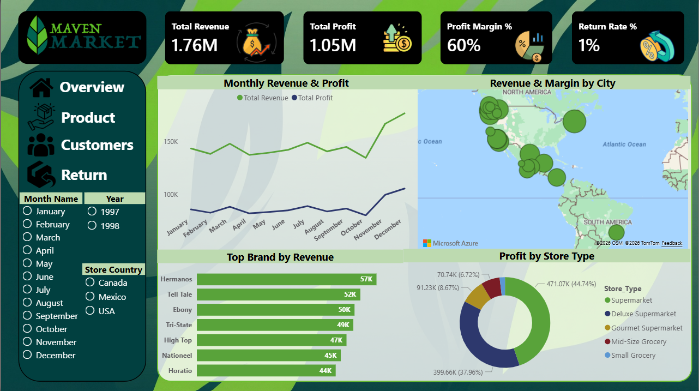
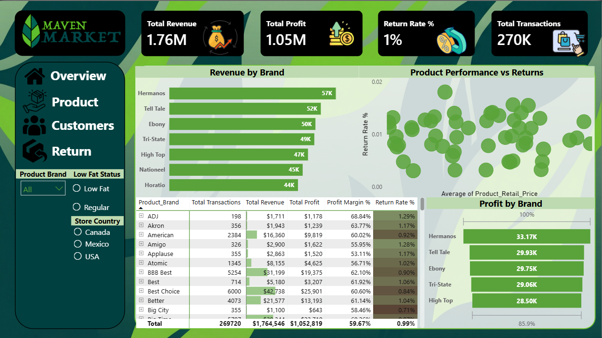
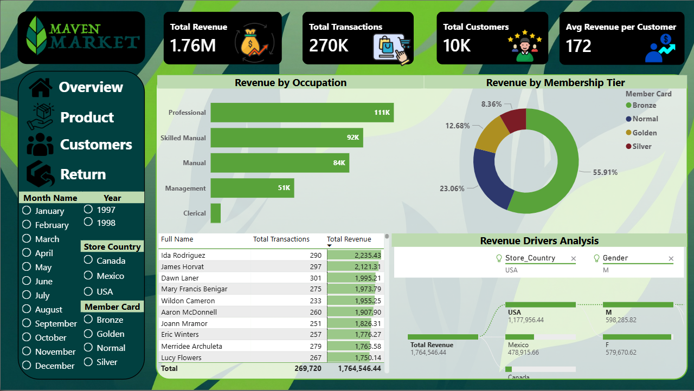
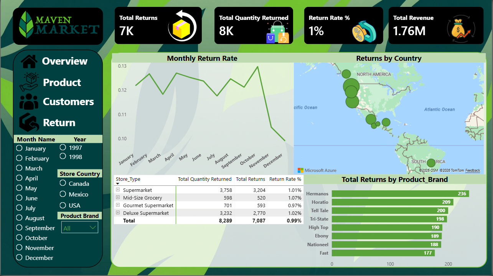

<div align="center">

# 🍫 Maven Market — Sales Analytics Dashboard

### A Professional Power BI Dashboard for End-to-End Sales Performance Analysis

[](https://powerbi.microsoft.com/)
[](https://github.com/)
[](https://github.com/)
[](https://github.com/)

---

> 📊 **Transforming raw retail data into actionable business intelligence** — built with Power BI, DAX, and real-world Maven Market datasets spanning 1997–1998.

</div>

---

## 📌 Table of Contents

- [Project Overview](#-project-overview)
- [Objectives](#-objectives)
- [Dashboard Pages](#-dashboard-pages)
- [Key Business Insights](#-key-business-insights)
- [Features](#-features)
- [Tools & Technologies](#%EF%B8%8F-tools--technologies)
- [Dataset Information](#-dataset-information)
- [Dashboard Screenshots](#-dashboard-screenshots)
- [Folder Structure](#-folder-structure)
- [How to Use](#-how-to-use)
- [Documentation](#-documentation)
- [Future Improvements](#-future-improvements)
- [Contributing](#-contributing)

---

## 🔍 Project Overview

The **Maven Market Sales Analytics Dashboard** is a multi-page, interactive Power BI report built on the Maven Market retail dataset. It delivers a 360-degree view of business performance — from revenue trends and product profitability to customer segmentation and return analysis — across multiple store locations in the USA, Canada, and Mexico.

This project demonstrates advanced Power BI skills including data modeling, DAX measure creation, cross-filtering, and executive-level visual storytelling.

---

## 🎯 Objectives

- ✅ Build a fully interactive, multi-page Power BI dashboard from raw CSV datasets
- ✅ Create a unified data model by connecting transactions, customers, products, stores, and regions
- ✅ Develop key DAX measures: Total Revenue, Profit Margin %, Return Rate %, and more
- ✅ Identify top-performing products, brands, and customer segments
- ✅ Visualize geographic sales distribution across North America
- ✅ Enable time-based filtering for year-over-year performance comparison (1997 vs 1998)
- ✅ Present insights in a clean, recruiter-ready portfolio format

---

## 📊 Dashboard Pages

The report contains **four dedicated pages**, each focusing on a distinct analytical domain:

| Page | Focus Area | Key Visuals |
|------|-----------|-------------|
| 🏠 **Overview** | High-level KPIs & trends | Monthly Revenue & Profit, Top Brands, Store Type Profit |
| 📦 **Product** | Product & brand performance | Revenue by Brand, Profit Table, Return Rate Scatter |
| 👥 **Customers** | Customer segmentation | Revenue by Occupation, Membership Tier, Revenue Drivers |
| 🔄 **Returns** | Return behavior analysis | Monthly Return Rate, Returns by Country & Brand |

---

## 💡 Key Business Insights

> The following insights are derived from the dashboard visualizations across the Maven Market dataset:

### 💰 Revenue & Profitability
- **Total Revenue reached $1.76M** with a strong **60% Profit Margin**, demonstrating healthy overall business performance.
- Revenue grew steadily throughout the year, with a notable **surge in Q4** (October–December), suggesting seasonal demand patterns.

### 🏪 Store & Brand Performance
- **Supermarkets** dominate store-type profitability, accounting for nearly **45% of total profit** ($471K), followed by Deluxe Supermarkets at ~38%.
- **Hermanos, Tell Tale, and Ebony** are the top three revenue-generating brands, each exceeding **$50K in revenue**.

### 👤 Customer Segmentation
- **Professional** occupation customers generate the highest revenue (**$111K**), followed by Skilled Manual (**$92K**) and Manual (**$84K**).
- **Bronze membership** holders represent the largest customer segment (**55.91%** of revenue by membership tier), indicating a strong base of regular shoppers.
- **USA** drives the majority of revenue (**$1.18M**), more than double Mexico and Canada combined.

### 🔄 Returns Analysis
- The overall **Return Rate is just 1%**, reflecting strong product quality and customer satisfaction.
- **Mid-Size Grocery** stores have a slightly higher return rate (**1.07%**) compared to other store types.
- **Hermanos** leads total returns by brand volume (**236 returns**), which correlates with its position as the top-selling brand.

---

## ✨ Features

- 🗂️ **Multi-page report** with intuitive navigation between Overview, Product, Customers, and Returns
- 🔘 **Dynamic slicers** for Month, Year, Store Country, Member Card type, and Product Brand
- 🗺️ **Interactive map visualizations** showing Revenue & Returns by geographic location
- 📈 **Time-series analysis** for Monthly Revenue, Profit, and Return Rate trends
- 🔬 **Revenue Drivers Analysis** — decomposition tree to identify contributing factors
- 📋 **Detailed data tables** with conditional formatting for Profit Margin and Return Rate
- 🎯 **Scatter plot** for Product Performance vs Return Rate analysis
- 🎨 **Consistent green-themed branding** aligned with the Maven Market identity

---

## 🛠️ Tools & Technologies

| Tool | Purpose |
|------|---------|
|  | Dashboard development, data modeling, DAX |
| **DAX (Data Analysis Expressions)** | Custom KPI measures and calculated columns |
| **Power Query (M Language)** | Data cleaning, transformation, and loading |
| **Microsoft Azure Maps** | Geographic revenue & return visualizations |
| **CSV / Relational Data Model** | Source data in star schema format |
| **GitHub** | Version control and portfolio presentation |

---

## 📁 Dataset Information

The project uses the official **Maven Market** dataset, comprising **9 CSV files** with data from **1997–1998**:

| File | Rows | Description |
|------|------|-------------|
| `MavenMarket_Transactions_1997.csv` | 86,837 | All sales transactions in 1997 |
| `MavenMarket_Transactions_1998.csv` | 182,883 | All sales transactions in 1998 |
| `MavenMarket_Customers.csv` | 10,281 | Customer demographics & membership info |
| `MavenMarket_Products.csv` | 1,560 | Product catalog with cost & retail pricing |
| `MavenMarket_Stores.csv` | 24 | Store details including location & size |
| `MavenMarket_Regions.csv` | 109 | Sales regions and district mapping |
| `MavenMarket_Returns_19971998.csv` | 7,087 | Product return records |
| `MavenMarket_Calendar.csv` | 730 | Date dimension table |

**Data Model:** Star schema with `Transactions` as the central fact table, linked to dimension tables via `product_id`, `customer_id`, `store_id`, and `date` keys.

---

## 📸 Dashboard Screenshots

> 📂 All screenshots are stored in the `Assets/` folder.

### 🏠 Overview Page

*High-level KPIs, monthly revenue & profit trends, top brands, and profit by store type.*

---

### 📦 Products Page

*Revenue and profit by brand, product performance vs return rate scatter plot, and detailed brand table.*

---

### 👥 Customers Page

*Revenue by occupation, membership tier breakdown, customer leaderboard, and revenue drivers analysis.*

---

### 🔄 Returns Page

*Monthly return rate trends, returns by country map, store type breakdown, and top returned brands.*

---

## 🗂️ Folder Structure

```
Maven-Market-PowerBI-Dashboard/
│
├── 📁 Assets/                          # All images and visual assets
│   ├── Overview_Page.png               # Screenshot — Overview dashboard
│   ├── Products_Page.png               # Screenshot — Products dashboard
│   ├── Customers_Page.png              # Screenshot — Customers dashboard
│   ├── Returns_Page.png                # Screenshot — Returns dashboard
│   └── dashboard-preview.png           # Main preview image for README
│
├── 📁 Chocolate-Sales-Datasets/        # Raw source CSV data files
│   ├── MavenMarket_Transactions_1997.csv
│   ├── MavenMarket_Transactions_1998.csv
│   ├── MavenMarket_Customers.csv
│   ├── MavenMarket_Products.csv
│   ├── MavenMarket_Stores.csv
│   ├── MavenMarket_Regions.csv
│   ├── MavenMarket_Returns_19971998.csv
│   └── MavenMarket_Calendar.csv
│
├── 📁 Dashboard/                       # Power BI project file
│   └── MavenMarket_Dashboard.pbix      # Main Power BI report file
│
├── 📁 Docs/                            # Supporting documentation
│   ├── Maven_Market_Analysis.pdf       # Full business analysis report
│   ├── Data_Dictionary.md              # Column definitions & data types
│   └── DAX_Measures.md                 # All custom DAX measures used
│
└── 📄 README.md                        # Project documentation (this file)
```

---

## 🚀 How to Use

### Prerequisites
- [Power BI Desktop](https://powerbi.microsoft.com/desktop/) (free) installed on your machine
- Git (optional, for cloning the repository)

### Steps

**1. Clone or Download the Repository**
```bash
git clone https://github.com/Mohanad234128/Maven-Market-Analysis.git
cd Maven-Market-Analysis
```

**2. Open the Dashboard**
```
Navigate to: Dashboard/MavenMarket_Dashboard.pbix
Double-click to open in Power BI Desktop
```

**3. Refresh the Data (Optional)**
```
Home → Transform Data → Close & Apply
```
> ⚠️ If prompted for data source paths, redirect to the `Chocolate-Sales-Datasets/` folder.

**4. Explore the Report**
- Use the **left-side navigation** to switch between Overview, Product, Customers, and Returns pages
- Use **slicers** (Month, Year, Country, Member Card) to filter data dynamically
- Hover over visuals for **detailed tooltips**
- Click any chart element to **cross-filter** other visuals on the page

---

## 📄 Documentation

Full project documentation is available in the `Docs/` folder:

| Document | Description |
|----------|-------------|
| 📑 `Maven_Market_Analysis.pdf` | Comprehensive business analysis report with methodology and findings |
| 📝 `Data_Dictionary.md` | Definitions for all dataset columns and data types |
| 🧮 `DAX_Measures.md` | All custom DAX measures with formulas and explanations |

---

## 🔮 Future Improvements

- [ ] 🤖 **Predictive Analytics** — Integrate Python/R visuals for sales forecasting using time-series models
- [ ] 📊 **Year-over-Year Comparison** — Add dedicated YoY growth metrics and variance analysis
- [ ] 🌐 **Power BI Service Publishing** — Deploy to Power BI Service for live web-based access
- [ ] 📧 **Automated Reporting** — Schedule email delivery of monthly KPI summaries
- [ ] 🛒 **Customer Lifetime Value (CLV)** — Build CLV segmentation model using RFM analysis
- [ ] 📱 **Mobile Layout** — Optimize dashboard layout for Power BI mobile app
- [ ] 🔗 **Live Data Integration** — Connect to SQL database or API for real-time data refresh

---

## 🤝 Contributing

Contributions, suggestions, and feedback are warmly welcome!

**To contribute:**

1. Fork the repository
2. Create a new branch: `git checkout -b feature/your-feature-name`
3. Make your changes and commit: `git commit -m "Add: your feature description"`
4. Push to your fork: `git push origin feature/your-feature-name`
5. Open a **Pull Request** with a clear description of your changes

For major changes, please open an **Issue** first to discuss what you'd like to change.

---

<div align="center">

---

### ⭐ If this project helped you or inspired your work, please consider giving it a star!

*It takes just one click — but it means the world and helps others discover this project.*

[](https://github.com/Mohanad234128/Maven-Market-Analysis.git)

---

*Built with ❤️ and a lot of DAX — by [Mohanad Ibrahim Elsayed](https://github.com/Mohanad234128)*

</div>
